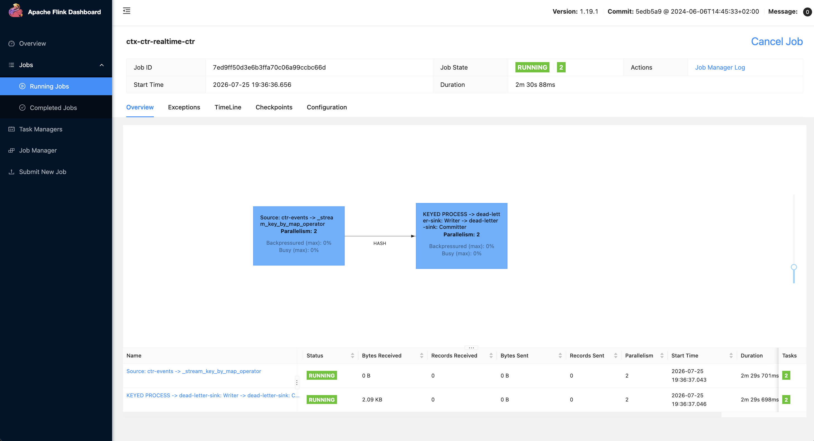

# Realtime CTR Flink Topology

The screenshot shows the `ctx-ctr-realtime-ctr` streaming job running with
parallelism `2`. Flink displays two chained operator vertices:

1. **Kafka source and key extraction** reads `ctr.impressions` and `ctr.clicks`
   and creates the contextual bucket key.
2. **Keyed CTR processing and dead-letter sink** maintains Bayesian CTR state,
   schedules periodic Redis flushes, and sends rejected events to
   `ctr.dead-letter`.

The `HASH` edge is produced by `key_by`. It deterministically routes every
`(ad category, publisher domain, conversation context)` bucket to one keyed
process subtask. Events for the same bucket therefore update the same Flink
`ValueState`, while different buckets can be processed concurrently.

Both vertices have two subtasks. Kafka's six partitions can be distributed
between the two source subtasks, and the hash exchange redistributes records
between the two keyed-processing subtasks.
